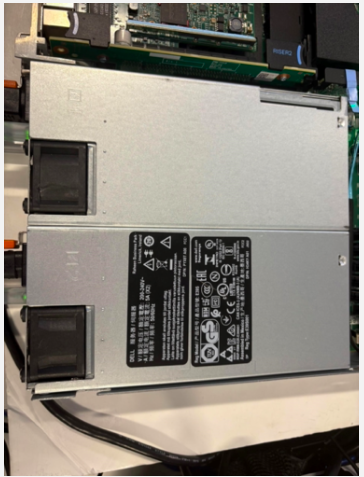
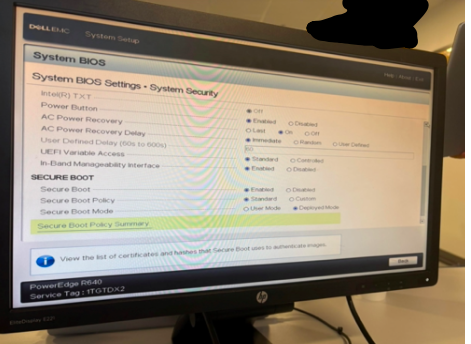

# Data Center Lab – Server Hardware & Infrastructure (GLAB)

## 📌 Overview
This project highlights hands-on data center lab experience completed during my training at Per Scholas. These labs focused on enterprise server hardware, diagnostics, storage configuration, and system reliability.

---

## 🔧 Labs Completed

### Server Hardware & Power Systems
- Configured and tested redundant server power supplies
- Ensured system uptime and hardware reliability

### Server Break/Fix & Diagnostics
- Diagnosed and resolved hardware-related issues
- Performed troubleshooting on enterprise servers

### Remote Management (iDRAC & LCC)
- Configured iDRAC for remote server access
- Used Lifecycle Controller (LCC) for system monitoring and updates

### RAID Configuration
- Configured RAID 1 and RAID 5 for redundancy and performance
- Verified storage integrity and fault tolerance

### Network Isolation & Testing
- Performed isolation testing to identify system/network issues
- Troubleshot connectivity and system failures

### Dell Server Diagnostics
- Conducted diagnostic testing on Dell PowerEdge R630 servers
- Identified and resolved hardware and system issues

---

## 🛠 Tools & Technologies
- Dell PowerEdge R630
- RAID Controller
- iDRAC / Lifecycle Controller
- Enterprise Server Hardware

---

## 💡 Key Skills Gained
- Server hardware troubleshooting
- Data redundancy and RAID configuration
- Remote server management
- Data center diagnostics and testing
- Problem-solving in high-availability environments

---

## 📸 Screenshots

